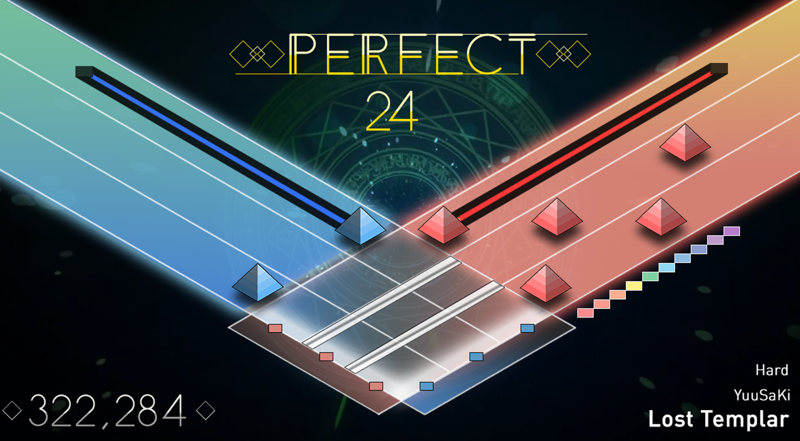
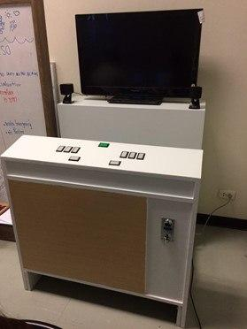

# iso2 (2016)
[Gameplay Video](https://youtu.be/DMP_Vq22tMc)

"Project 150 or "iso" is a rhythm action arcade game running on arcade platform. The game is equipped with brand-new gameplay that have never existed before. Project 150 tries to enhance skills of sense coordination of player. As the game is an arcade game, it means that players have to pay or insert coins to play. This will challenge players in survivability."

The game consists of two part which are the software and the hardware. This git repository consists only the game software of the project. Also, the game is updated to Unity 2020.1.9f from Unity 5.3.5 for releasing into Github.

*Image of the game arcade cabinet*
# Game Controls

Q - Insert Coin

ESDF - Left buttons

IJKL - Right buttons

Enter - Start button

# Credits
## Team Member
Jitprasert Chungthanacharoen -- Game Designer, 2D Artist, Chart Designer

Napat Wongchurairat -- Game Designer, Chart Designer, Programmer

Thanik Sitthichoksakulchai -- Lead Programmer, Arduino Programmer
## Music
"Do you know?" by Machina

"Lost Templar" by YuuSaKi

"Maid Battle" by 5argon

"Running Out" by flicknote

"As Time Goes By..." by phil_wc pres.Hemoi
